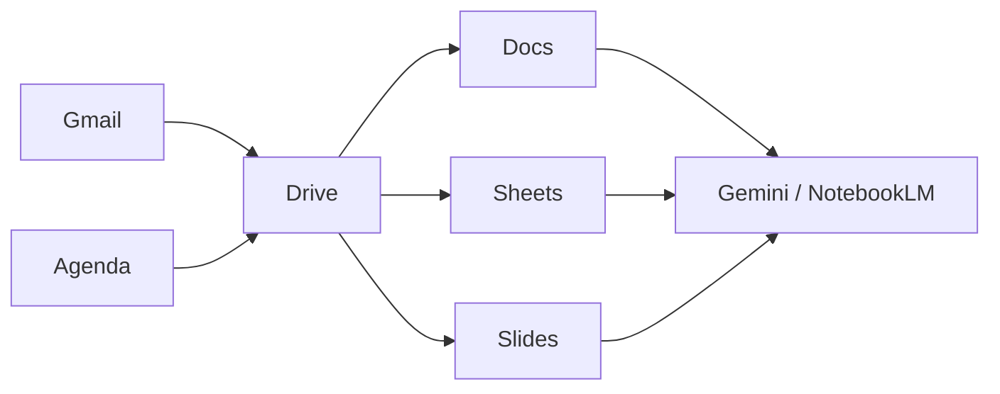

## Cadre général

**Outils informatiques & IA** — 1e bachelier ingénieur industriel ISIB

- Maîtriser les **outils Google** utiles aux études et au travail d'équipe
- Découvrir l'**IA Google** (Gemini, NotebookLM) avec un usage critique
- Distinguer **LLM** (assistant textuel) et **approche agentique**
- Format : démo → pratique guidée → **tâches évaluées** à réaliser

| Élément | Détail |
| --- | --- |
| Durée | **7 × 1 h 30** (= 10 h 30) |
| Compte | Google / Workspace étudiant |
| Langue | français (interfaces souvent en EN) |

---

## Séance 1

Cadre du cours & Gmail

[→ Tâches évaluées](taches_seance_01.html)

---

## Objectifs de la séance

- Situer le cours dans le parcours ISIB
- Se connecter correctement (compte **institutionnel** vs perso)
- Structurer Gmail : libellés, filtres, recherche
- Écrire un mail professionnel clair
- Éviter les pièges (spam, phishing, pièces jointes)

---

## Pourquoi ces outils ?

En école d'ingénieurs, vous allez :

- **communiquer** avec enseignants et groupes de projet
- **planifier** échéances, labos, examens
- **produire** des documents, tableaux, présentations
- **collaborer** en temps réel
- **utiliser l'IA** sans déléguer votre responsabilité intellectuelle

Ce cours pose les bases pour le reste du cursus (et le stage / métier).

---

## Compte : lequel utiliser ?

| Usage | Compte recommandé |
| --- | --- |
| Cours ISIB, mails HE2B, Drive de groupe | **Compte institutionnel** |
| Vie privée | Compte personnel (séparé) |

Règle d'or : **ne pas mélanger** vie perso et vie scolaire dans le même Drive / Agenda.

Vérifiez l'adresse affichée en haut à droite de chaque app Google.

---

## Vue d'ensemble Google Workspace

Les fichiers vivent dans **Drive**. Gmail et Agenda **pointent** vers des fichiers / événements.

---

## Gmail : interface utile

Zones à connaître :

1. **Boîte de réception** — messages non traités
2. **Libellés** (*labels*) — organisation (pas des dossiers exclusifs)
3. **Recherche** — opérateurs puissants
4. **Étoiles / importance** — priorisation visuelle
5. **Paramètres** → Voir tous les paramètres

Astuce : un message peut avoir **plusieurs libellés** à la fois.

---

## Recherche efficace

Exemples d'opérateurs :

| Opérateur | Effet |
| --- | --- |
| `from:shuraux@he2b.be` | expéditeur |
| `subject:labo` | objet |
| `has:attachment` | avec pièce jointe |
| `newer_than:7d` | 7 derniers jours |
| `is:unread` | non lus |
| `filename:pdf` | PJ PDF |

Combinez : `from:prof subject:examen has:attachment`

---

## Libellés et filtres

Workflow recommandé :

1. Créer des libellés : `ISIB / Cours`, `ISIB / Projet`, `Admin`, `À traiter`
2. Créer un **filtre** : si `from:` ou `subject:` → appliquer libellé (+ optionnellement ignorer boîte de réception)
3. Traiter la boîte : **répondre**, **planifier**, ou **archiver**

Objectif : boîte de réception ≈ liste de tâches, pas un grenier.

---

## Structure d'un mail professionnel

1. **Objet** précis : `[TI1] Question séance 3 — boucles`
2. **Salutation** adaptée
3. **Contexte** en 1–2 phrases
4. **Demande** claire (une question principale)
5. **Infos utiles** : groupe, séance, deadline
6. **Formule de politesse** + signature (nom, section)

Évitez les pavés, les « Urgent!!! », les captures illisibles sans commentaire.

---

## Pièces jointes et liens Drive

| Situation | Préférer |
| --- | --- |
| Petit fichier ponctuel | Pièce jointe |
| Document de travail / versions | **Lien Drive** + droits |
| Destinataires nombreux | Lien Drive (évite les copies) |

Avant d'envoyer : vérifier **qui peut ouvrir** le lien (restreint / domaine / public).

---

## Sécurité basique

Signaux d'alerte (*phishing*) :

- Urgence artificielle (« compte suspendu dans 1 h »)
- Expéditeur douteux / adresse ressemblante
- Lien qui ne mène pas au vrai site Google / HE2B
- Demande de mot de passe ou de code 2FA

En cas de doute : **ne pas cliquer**, vérifier via un autre canal, signaler comme phishing.

---

## Bonnes pratiques Gmail (synthèse)

- Compte institutionnel pour le scolaire
- Objet clair + corps structuré
- Libellés + filtres pour classer
- Recherche par opérateurs
- Liens Drive plutôt que 5 versions en PJ
- Vigilance phishing

---

## Pour la prochaine séance

- Appliquer 2 libellés + 1 filtre sur votre boîte ISIB
- **Séance 2 :** Google Agenda & Drive (organisation du temps et des fichiers)
