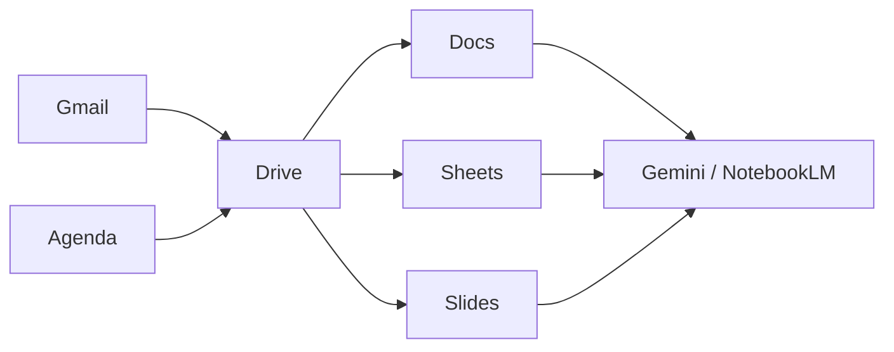

## Séance 1

Gmail & Agenda

---

## Objectifs de la séance

- Se connecter correctement (compte **institutionnel** vs perso)
- Structurer Gmail : libellés, filtres, recherche
- Écrire un mail professionnel clair
- Planifier avec **Google Agenda** : vues, événement, invitation, rappels
- Éviter les pièges (phishing mail ; double réservation / oubli de fuseau)

---

## Compte : lequel utiliser ?

| Usage | Compte recommandé |
| --- | --- |
| Cours ISIB, mails HE2B, Drive de groupe | **Compte institutionnel** |
| Vie privée | Compte personnel (séparé) |

Règle d'or : **ne pas mélanger** vie perso et vie scolaire dans le même Drive / Agenda.

Vérifiez l'adresse affichée en haut à droite de chaque app Google.

---

## Vue d'ensemble Google Workspace

Les fichiers vivent dans **Drive**. Gmail et Agenda **pointent** vers des fichiers / événements.

---

## Gmail : interface utile

Zones à connaître :

1. **Boîte de réception** — messages non traités
2. **Libellés** (*labels*) — organisation (pas des dossiers exclusifs)
3. **Recherche** — opérateurs puissants
4. **Étoiles / importance** — priorisation visuelle
5. **Paramètres** → Voir tous les paramètres

Astuce : un message peut avoir **plusieurs libellés** à la fois.

---

## Recherche efficace

Exemples d'opérateurs :

| Opérateur | Effet |
| --- | --- |
| `from:shuraux@he2b.be` | expéditeur |
| `subject:labo` | objet |
| `has:attachment` | avec pièce jointe |
| `newer_than:7d` | 7 derniers jours |
| `is:unread` | non lus |
| `filename:pdf` | PJ PDF |

Combinez : `from:prof subject:examen has:attachment`

---

## Libellés et filtres

Workflow recommandé :

1. Créer des libellés : `ISIB / Cours`, `ISIB / Projet`, `Admin`, `À traiter`
2. Créer un **filtre** : si `from:` ou `subject:` → appliquer libellé (+ optionnellement ignorer boîte de réception)
3. Traiter la boîte : **répondre**, **planifier**, ou **archiver**

Objectif : boîte de réception ≈ liste de tâches, pas un grenier.

---

## Structure d'un mail professionnel

1. **Objet** précis : `[TI1] Question séance 3 — boucles`
2. **Salutation** adaptée
3. **Contexte** en 1–2 phrases
4. **Demande** claire (une question principale)
5. **Infos utiles** : groupe, séance, deadline
6. **Formule de politesse** + signature (nom, section)

Évitez les pavés, les « Urgent!!! », les captures illisibles sans commentaire.

---

## Pièces jointes et liens Drive

| Situation | Préférer |
| --- | --- |
| Petit fichier ponctuel | Pièce jointe |
| Document de travail / versions | **Lien Drive** + droits |
| Destinataires nombreux | Lien Drive (évite les copies) |

Avant d'envoyer : vérifier **qui peut ouvrir** le lien (restreint / domaine / public).

---

## Sécurité basique (mail)

Signaux d'alerte (*phishing*) :

- Urgence artificielle (« compte suspendu dans 1 h »)
- Expéditeur douteux / adresse ressemblante
- Lien qui ne mène pas au vrai site Google / HE2B
- Demande de mot de passe ou de code 2FA

En cas de doute : **ne pas cliquer**, vérifier via un autre canal, signaler comme phishing.

---

## Bonnes pratiques Gmail (synthèse)

- Compte institutionnel pour le scolaire
- Objet clair + corps structuré
- Libellés + filtres pour classer
- Recherche par opérateurs
- Liens Drive plutôt que 5 versions en PJ
- Vigilance phishing

---

## Agenda : pourquoi c'est critique

Sans agenda fiable :

- on rate les labos / remises
- on double-booke les réunions de projet
- on découvre les deadlines la veille

Objectif : **une seule source de vérité** pour votre semaine ISIB (compte institutionnel).

---

## Vues Agenda

| Vue | Usage typique |
| --- | --- |
| Jour | Détail d'une journée chargée |
| Semaine | Planification ISIB (recommandée) |
| Mois | Vision des deadlines / examens |
| Planning | Liste chronologique |

Astuce : colorer par catégorie (cours / projet / perso / examens).

---

## Types d'événements

| Type | Exemple |
| --- | --- |
| Cours / labo récurrent | TI1 chaque lundi 10:30–12:00 |
| Deadline | Remise rapport — **journée entière** |
| Réunion projet | Meet + lien dans la description |
| Bloc focus | 2 h révision (bloquer le créneau) |

---

## Créer un événement utile

Champs essentiels :

1. Titre clair : `Labo TI1 — séances 3–4`
2. Date / heure / **fuseau** (Bruxelles)
3. **Lieu** ou lien Meet
4. Description : consignes, local, lien Drive
5. **Rappel** (ex. 10 min / 1 jour)
6. Invités (groupe de projet)

Pour un examen : événement **journée entière** + rappels J-7 et J-1.

---

## Invitation Calendar

Différence importante :

| Approche | Résultat |
| --- | --- |
| Mail « on se voit mardi » | Pas dans l'agenda de l'autre |
| **Invitation Agenda** | Créneau proposé / accepté, rappel possible |

Toujours **inviter** les coéquipiers via Agenda (pas seulement un message Gmail).

---

## Fuseau horaire et récurrence

- Vérifier Paramètres Agenda → **fuseau** (Europe/Brussels)
- Attention aux événements créés à l'étranger / en voyage
- Récurrence : cours hebdomadaires — vérifier les exceptions (jours fériés, congés)

---

## Agendas multiples

- Agenda principal (votre boîte)
- Agenda secondaire : `ISIB — deadlines`, `Projet X`
- Agendas partagés d'équipe (lecture seule pour certains)

Affichez / masquez les agendas pour alléger la vue semaine.

---

## Bonnes pratiques Agenda (synthèse)

- Compte institutionnel = planning scolaire
- Titres explicites + rappels
- Deadlines en **journée entière**
- Invitations Calendar pour les réunions
- Couleurs / agendas séparés si besoin
- Fuseau Bruxelles contrôlé

---

## Pour la prochaine séance

- Finaliser mail + invitation Agenda (tâches évaluées)
- **Séance 2 :** Google Drive (fichiers, arborescence, partage)

[→ Tâches évaluées](taches_seance_01.html)
