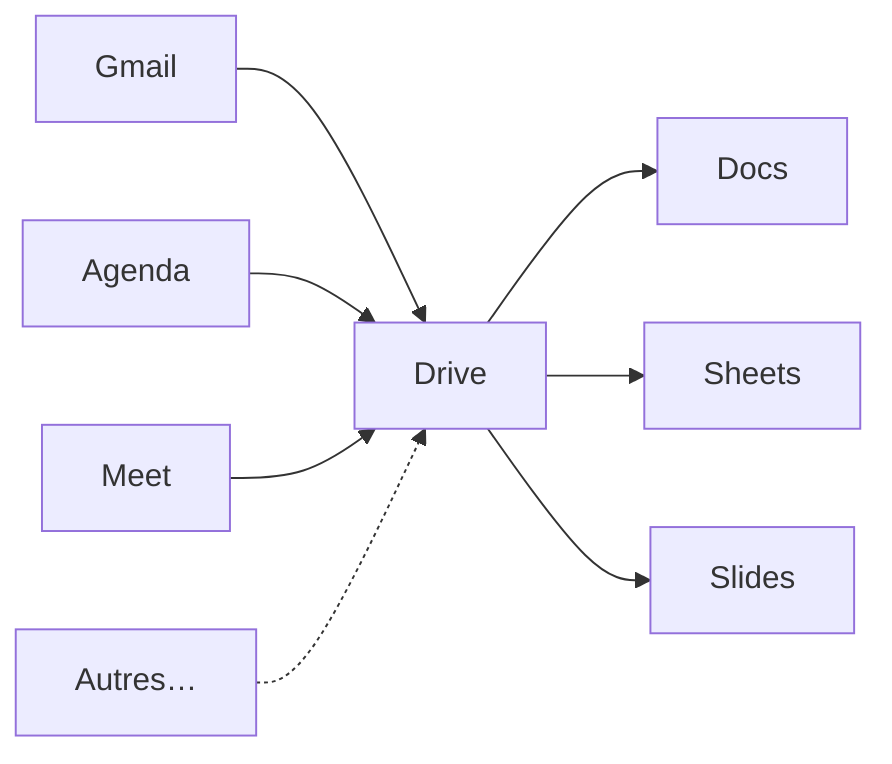

## Séance 1

Gmail, Agenda, (Tasks et Meet)

---

## Objectifs de la séance

- Distinguer compte **institutionnel** et compte **personnel**
- Utiliser les fonctionnalités Gmail : libellés, filtres, recherche
- Écrire un mail professionnel clair
- Planifier avec **Google Agenda** : vues, événement, invitation, rappels

---

## Compte mail pour les cours ISIB

**Ne pas** envoyer de mails de cours / ISIB avec votre boîte **personnelle**.

| Situation | Compte à utiliser |
| --- | --- |
| Mail à un enseignant, secrétariat, groupe de projet ISIB | **Compte institutionnel** |
| Vie privée | Compte personnel (séparé) |

Vérifiez l'adresse affichée en haut à droite avant d'envoyer.

---

## Vue d'ensemble Google Workspace

**Gmail**, **Agenda** et **Meet** sont au même niveau (communication / rendez-vous) ; la case **Autres…** rappelle qu'il existe encore d'autres outils dans la suite.  
Les fichiers vivent dans **Drive** ; Docs, Sheets et Slides s'y appuient.

---

## Gmail : interface utile

Zones à connaître :

1. **Boîte de réception** — messages non traités
2. **Libellés** (*labels*) — organisation (pas des dossiers exclusifs)
3. **Recherche** — opérateurs puissants
4. **Étoiles / importance** — priorisation visuelle
5. **Paramètres** → Voir tous les paramètres

Astuce : un message peut avoir **plusieurs libellés** à la fois.

---

## Recherche efficace

Exemples d'opérateurs :

| Opérateur | Effet |
| --- | --- |
| `from:shuraux@he2b.be` | expéditeur |
| `subject:labo` | objet |
| `has:attachment` | avec pièce jointe |
| `newer_than:7d` | 7 derniers jours |
| `is:unread` | non lus |
| `filename:pdf` | PJ PDF |

Combinez : `from:prof subject:examen has:attachment`

---

## Libellés et filtres

Workflow recommandé :

1. Créer des libellés : `ISIB / Cours`, `ISIB / Projet`, `Admin`, `À traiter`
2. Créer un **filtre** : si `from:` ou `subject:` → appliquer libellé (+ optionnellement ignorer boîte de réception)
3. Traiter la boîte : **répondre**, **planifier**, ou **archiver**

Objectif : boîte de réception ≈ liste de tâches, pas un grenier.

---

## Structure d'un mail professionnel

1. **Objet** précis : `[TI1] Question séance 3 — boucles`
2. **Salutation** adaptée
3. **Contexte** en 1–2 phrases
4. **Demande** claire (une question principale)
5. **Infos utiles** : groupe, séance, deadline
6. **Formule de politesse** + signature (**nom** + **matricule** + **année avec groupe**)

**Évitez un mail sans objet.**  
Un mail **n'est pas** un message de discussion instantanée (WhatsApp, DM, chat…) : pas de « salut t'as 2 min ? », pas d'enchaînement de fragments sans contexte.

Évitez aussi les pavés, les « Urgent!!! », les captures illisibles sans commentaire.

---

<!-- _class: compact-table -->

## Cc, Bcc, répondre, transférer

| Français | Anglais | À quoi ça sert |
| --- | --- | --- |
| **À** | *To* | Destinataire principal |
| **Cc** (*copie carbone*) | *Cc* (*carbon copy*) | Mettre quelqu'un en copie (visible par tous) |
| **Cci** (*copie carbone invisible*) | *Bcc* (*blind carbon copy*) | Copie **cachée** : les autres ne voient pas cette adresse |
| **Répondre** | *Reply* | Répondre à l'expéditeur seulement |
| **Répondre à tous** | *Reply all* | Répondre à l'expéditeur **et** à toutes les personnes en À / Cc |
| **Transférer** | *Forward* | Envoyer le message (souvent avec PJ) à quelqu'un d'autre |

Attention : **répondre à tous** peut envoyer votre réponse à toute une liste — à utiliser volontairement.

---

## Google Chat

Google Chat **existe** dans l’écosystème Google (messagerie rapide, liée à Workspace).

- **Pas à privilégier** pour écrire aux **enseignants**, surtout en **Master** (préférez le **mail** institutionnel).
- En entreprise, on trouve souvent des outils **plus complets** : **Slack**, ou **Teams** si l’organisation est sur Microsoft.

Pour ce cours : Chat = à connaître de nom ; communication scolaire formelle = **Gmail**.

---

## Pièces jointes et liens Drive

| Situation | Préférer |
| --- | --- |
| Petit fichier ponctuel | Pièce jointe |
| Document de travail / versions | **Lien Drive** + droits |
| Destinataires nombreux | Lien Drive (évite les copies) |

Avant d'envoyer : vérifier **qui peut ouvrir** le lien (restreint / domaine / public).

---

## Règles de sécurité de base

Google dispose en général d'un **bon filtre anti-spam** : beaucoup de messages frauduleux n'arrivent même pas en boîte de réception.

Cela n'élimine pas tout risque. Signaux d'alerte (*phishing*) :

- Urgence artificielle (« compte suspendu dans 1 h »)
- Expéditeur douteux / adresse ressemblante
- Lien qui ne mène pas au vrai site Google / HE2B
- Demande de mot de passe ou de code 2FA

En cas de doute : **ne pas cliquer**, vérifier via un autre canal, signaler comme phishing.

---

## Google Agenda — le calendrier

Un **agenda** (*calendar*) = un calendrier : la vue d’ensemble de votre temps (jours, semaines, mois).

C’est le **contenant**. Les rendez-vous précis viendront ensuite (les **événements**).

Un PDF d’horaire, lui, ne se met pas à jour tout seul.

---

## Créer ou importer un calendrier

Dans Google Agenda, on peut :

- **créer** un calendrier (ex. `ISIB`, `Projet X`)
- **importer** / s’**abonner** à un calendrier existant (souvent via un lien **iCal** / `.ics`)

Un calendrier **synchronisable** suit vos appareils (téléphone, ordi, navigateur) — qu’il soit géré **dans Google** ou **à l’extérieur** (abonnement à un horaire diffusé par l’école, un club, etc.).

---

## L’événement (*event*)

Un **événement** = un créneau précis **dans** un calendrier : titre, date/heure, éventuellement lieu, description, invités, rappel.

Un événement est forcément **attaché à un calendrier**, et il est **propre à ce calendrier**.

Exemples : cours, labo, réunion projet, deadline (souvent en **journée entière**).

---

## Vues utiles

Modes courants : **jour**, **semaine**, **mois** — la semaine suffit souvent pour l’horaire ISIB.

Dans la liste des agendas (à gauche), on peut **cocher** ou **décocher** un calendrier pour l’**afficher** ou le **masquer** dans la vue, sans le supprimer.

---

## Créer un événement et inviter

Champs utiles : titre, date/heure (**fuseau** Bruxelles), lieu ou Meet, description, **rappel**, **invités**.

Différence clé :

| Approche | Résultat |
| --- | --- |
| Mail « on se voit mardi » | Pas dans l’agenda de l’autre |
| **Invitation à un événement** | Créneau chez l’invité, acceptation / rappel possibles |

---

## Google Tasks

**Google Tasks** (*Tâches*) = liste de **to-do** (cases à cocher), souvent à côté de Gmail / Agenda.

- Utile pour un rappel « à faire », sans bloquer un créneau horaire
- Ce n’est **pas** un événement Agenda : pas de réunion / pas d’invitation de calendrier

Pour planifier un rendez-vous avec quelqu’un → **événement**. Pour une liste perso → **Tasks**.

---

## Google Meet

**Google Meet** = visioconférence Google (au même niveau que Gmail / Agenda pour la communication).

- Lien de réunion généré depuis Meet, ou **attaché à un événement** Agenda
- Utile pour un cours à distance, un labo, une réunion de projet

---

## Tâche 1 — Mail simple

Envoyez **un seul mail** depuis le compte **institutionnel** à l’enseignant.

À vérifier :

1. objet avec « Outils info » **et** « séance 1 tâche 1 »
2. salutation + demande claire « pour faire jolie » + formule de politesse
3. signature : nom + matricule + année avec groupe

→ [Tâches évaluées](taches_seance_01.html)

---

## Tâche 2 — Invitation à un événement

Créez un **événement** Agenda et **invitez l’enseignant**.

À vérifier :

1. titre clair
2. créneau d’**1 h**, le **samedi** ou le **dimanche** avant la **deuxième séance** de cours
3. **rappel** activé

→ [Tâches évaluées](taches_seance_01.html)

---

## Deadline

Réalisation des deux tâches : **au plus tard la veille de la prochaine séance, à 20:00**.

→ [Tâches évaluées](taches_seance_01.html)
