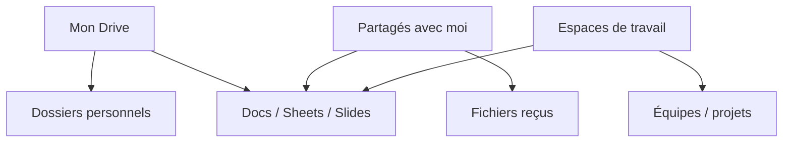

## Séance 2

Agenda & Drive

[→ Tâches](taches_seance_02.html)

---

## Objectifs de la séance

- Structurer **Google Agenda** (cours, deadlines, rappels)
- Créer / partager des événements et des agendas secondaires
- Organiser **Drive** : arborescence, nommage, raccourcis
- Comprendre **Mon Drive** vs **Partagés avec moi** vs **Espaces**
- Gérer les **droits** (lecteur, commentateur, éditeur)

---

## Agenda : pourquoi c'est critique

Sans agenda fiable :

- on rate les labos / remises
- on double-booke les réunions de projet
- on découvre les deadlines la veille

Objectif : **une seule source de vérité** pour votre semaine ISIB.

---

## Types d'événements

| Type | Exemple |
| --- | --- |
| Cours / labo récurrent | TI1 chaque lundi 10:30–12:00 |
| Deadline | Remise rapport — toute la journée |
| Réunion projet | Meet + lien dans la description |
| Bloc focus | 2 h révision (bloquer le créneau) |

Astuce : colorer par catégorie (cours / perso / projet / examens).

---

## Créer un événement utile

Champs essentiels :

1. Titre clair : `Labo TI1 — séances 3–4`
2. Date / heure / fuseau
3. **Lieu** ou lien Meet
4. Description : consignes, numéro de local, lien Drive
5. **Rappel** (notification 10 min / 1 jour)
6. Invités (groupe de projet)

Pour un examen : événement **journée entière** + rappel J-7 et J-1.

---

## Agendas multiples

- Agenda principal (votre boîte)
- Agenda secondaire : `ISIB — deadlines`, `Projet X`
- Agendas partagés d'équipe (lecture seule pour certains)

Affichez / masquez les agendas pour alléger la vue semaine.

---

## Drive : où vivent les fichiers



Ne stockez pas « tout à la racine » : créez une arborescence **stable**.

---

## Convention de nommage

Exemples :

- `2026-03-15_TI1_labo03_rapport.pdf`
- `ISIB_ProjetMeca_CR_reunion_04.md` (ou Doc)
- `methodo_algo_seance05_notes`

Évitez : `version finale VRAIMENT FINAL (2).docx`

Préférez date ISO (`AAAA-MM-JJ`) + sigle cours + contenu.

---

## Arborescence type (étudiant)

```
ISIB/
  01_Cours/
    TI1/
    MethodoAlgo/
    OutilsInfoIA/
  02_Projets/
    ProjetX/
  03_Admin/
  04_Archives/
```

Un dossier par activité d'apprentissage ; sous-dossiers par séance / livrable.

---

## Partage et droits

| Rôle | Peut… |
| --- | --- |
| Lecteur | ouvrir, télécharger (selon options) |
| Commentateur | commenter sans modifier le fond |
| Éditeur | modifier le contenu |
| Gestionnaire | gérer les membres (espaces) |

Avant de partager : **lien restreint** par défaut ; élargir seulement si nécessaire.

---

## Raccourcis vs copies

- **Raccourci** : pointe vers le fichier original (reste synchronisé)
- **Copie** : doublon (risque de versions divergentes)

Pour un livrable commun : **un seul fichier** partagé + raccourcis dans vos dossiers.

---

## Corbeille et versions

- Fichier supprimé → Corbeille Drive (récupérable un temps)
- Docs/Sheets/Slides : **historique des versions** (Fichier → Historique)
- Ne comptez pas sur la Corbeille comme backup long terme

---

## Lien Agenda ↔ Drive

Bonne habitude :

1. Créer le dossier projet dans Drive
2. Mettre le lien dans l'événement Agenda (réunion / deadline)
3. Joindre le Doc de CR / le Sheet de suivi

Ainsi, le planning et les fichiers restent connectés.

---

## Pour la prochaine séance

- Créer l'arborescence `ISIB/` + 3 événements Agenda (cours, deadline, réunion)
- **Séance 3 :** Google Docs (rédaction, styles, collaboration)
