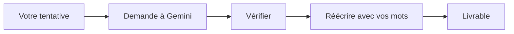

## Séance 6

Gemini & NotebookLM

[→ Quiz](quiz_seance_06.html)
[→ Exercices](exercices_seance_06.html)

---

## Objectifs de la séance

- Situer **Gemini** dans l'écosystème Google
- Formuler des prompts utiles (contexte, contrainte, format)
- Utiliser **NotebookLM** sur vos propres sources de cours
- Vérifier / citer / ne pas inventer de références
- Connaître limites, confidentialité, règles académiques

---

## Gemini : à quoi ça sert ?

Assistant conversationnel multimodal (texte, et selon compte : images, fichiers…).

Usages étudiants **légitimes** :

- reformuler / clarifier un concept déjà vu
- proposer un plan de révision
- générer des questions d'auto-test
- expliquer une erreur (après votre tentative)

Usages **problématiques** : faire faire le travail noté à votre place.

---

## Anatomie d'un bon prompt

Incluez :

1. **Rôle / contexte** : « Je suis en 1e ISIB, cours Outils Info & IA »
2. **Tâche** claire
3. **Contraintes** : niveau, longueur, langue
4. **Format** de sortie : liste, tableau, étapes
5. **Données** : collez l'extrait / le brief

Vague → réponse vague. Précis → réponse actionnable.

---

## Exemple : prompt faible vs fort

**Faible :** « Explique Drive »

**Fort :** « En 8 puces max, pour un étudiant ISIB débutant, compare *Mon Drive*, *Partagés avec moi* et un *Espace de travail*. Termine par 3 erreurs fréquentes. »

---

## Boucle de travail recommandée

L'IA **accélère** ; elle ne remplace pas la compréhension ni la responsabilité.

---

## NotebookLM : idée clé

NotebookLM travaille à partir de **sources que vous déposez** (PDF, Docs, notes…).

Intérêt :

- questions ancrées dans **votre** cours
- résumés / FAQ / guides d'étude
- moins d'« hallucination libre » qu'un chat sans documents — **mais** toujours vérifier

---

## Workflow NotebookLM type

1. Créer un notebook « TI1 — Bloc boucles »
2. Ajouter polycopiés / slides / vos notes (droits OK)
3. Poser des questions ciblées
4. Demander un quiz ou une fiche
5. Recouper avec le cours officiel

Ne televersez pas de documents confidentiels ou non autorisés.

---

## Gemini dans Docs / Sheets / Slides

Selon votre compte / licence :

- aide à la rédaction / reformulation
- suggestions de formules
- idées de structure de slides

Gardez le contrôle : acceptez **phrase par phrase**, pas en aveugle.

---

## Hallucinations : reconnaître le risque

Signaux :

- citations / URLs inventées
- détails trop précis non présents dans vos sources
- ton très confiant malgré l'incertitude

Contre-mesures : demander les sources, vérifier dans le polycopié, tester sur un cas connu.

---

## Confidentialité & éthique

- Ne collez pas de données personnelles sensibles de tiers
- Respectez le règlement des examens / travaux
- Déclarez l'usage de l'IA si l'enseignant le demande
- Vous restez **auteur responsable** du rendu

---

## Exercice mental : bon usage

| Demande | OK ? |
| --- | --- |
| « Génère mon rapport de labo complet » | Non (fraude / non-apprentissage) |
| « Critique la structure de mon plan » | Oui |
| « Pose-moi 5 QCM sur Agenda » | Oui |
| « Invente des références IEEE » | Non |

---

## Pour la prochaine séance

- Créer un notebook NotebookLM avec 1–2 sources de cours + 5 questions
- **Séance 7 :** LLM vs agentique & synthèse du module
