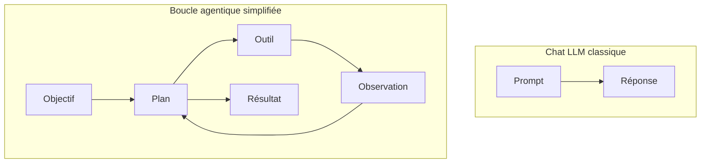
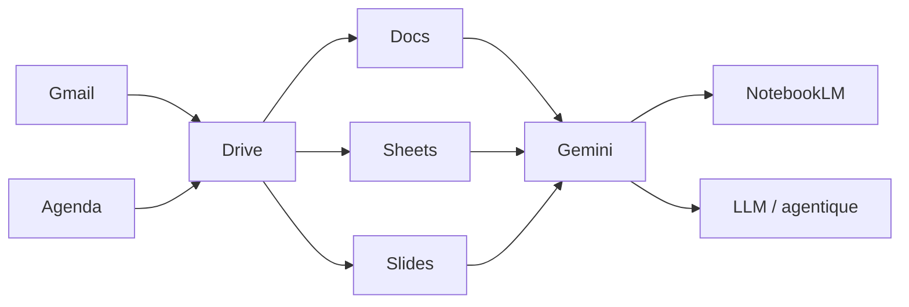

## Séance 7

LLM vs agentique & synthèse

[→ Tâches](taches_seance_07.html)

---

## Objectifs de la séance

- Distinguer **LLM** (modèle de langage) et **système agentique**
- Comprendre outils, boucles, autonomie (niveau intro)
- Relier Gemini / NotebookLM à ces notions
- Synthétiser le module Workspace + IA
- Formuler une **charte d'usage** personnelle

---

## Qu'est-ce qu'un LLM ?

**Large Language Model** : modèle entraîné à prédire / générer du texte (et parfois d'autres modalités).

- Entrée : prompt (+ éventuellement fichiers)
- Sortie : texte (réponse, code, plan…)
- Pas de « compréhension » au sens humain ; **statistique + patterns**

Gemini (chat) est une interface vers ce type de capacité.

---

## Limites classiques d'un LLM seul

- Peut inventer (halluciner)
- Coupe de connaissances / contexte
- Pas d'accès durable au monde réel **sauf** outils branchés
- Suit les instructions… y compris les mauvaises

D'où l'importance de **vérifier** et de cadrer l'usage scolaire.

---

## Vers l'agentique : idée simple

Un **agent** (au sens large) :

1. reçoit un **objectif**
2. **planifie** des étapes
3. utilise des **outils** (recherche, calendrier, code, API…)
4. observe le résultat
5. **ajuste** jusqu'à (tenter d') atteindre le but

Le LLM peut être le « cerveau » qui décide quoi faire ensuite.

---

## LLM chat vs boucle agentique

Différence clé : **actions + rétroaction**, pas seulement une réponse textuelle unique.

---

## Exemples concrets (niveau intro)

| Situation | Plutôt… |
| --- | --- |
| « Explique-moi les filtres Gmail » | LLM chat |
| « Surveille ma boîte, classe les mails ISIB, crée des tâches Agenda » | Agentique (outils + boucle) |
| NotebookLM qui répond **sur vos PDF** | LLM + **outil / RAG** sur sources |
| Assistant qui réserve, clique, exécute | Agentique (autonomie ↑) |

Les frontières produit évoluent vite — retenez les **concepts**.

---

## Autonomie : curseur de risque

Plus l'outil agit seul (envoyer un mail, modifier un fichier, payer…) :

- plus c'est **puissant**
- plus il faut **garde-fous** (validation humaine, droits limités)

En 1e année : utilisez l'IA surtout en **copilote**, pas en pilote automatique.

---

## Carte mentale du module

Workspace = productivité & collaboration. IA = accélérateur **sous contrôle**.

---

## Synthèse compétences

Vous devez être capables de :

1. Communiquer pro avec Gmail
2. Planifier avec Agenda + classer avec Drive
3. Produire Docs / Sheets / Slides propres
4. Prompting utile + NotebookLM sur sources
5. Expliquer LLM vs agentique en termes simples
6. Appliquer une éthique d'usage académique

---

## Charte d'usage (proposition)

1. Je tente d'abord par moi-même
2. Je précise contexte et contraintes à l'IA
3. Je vérifie faits, chiffres, citations
4. Je réécris avec mes mots
5. Je ne fais pas faire les évaluations à ma place
6. Je protège données personnelles / confidentielles

Adoptez / adaptez — ce sera votre boussole.

---

## Pour la suite du cursus

Ces outils reviendront partout : labos, projets, stage, mémoire.

Investissement utile :

- arborescence Drive stable
- Agenda comme source de vérité
- modèles Docs / Slides réutilisables
- notebooks NotebookLM par cours
- esprit critique face aux sorties IA

---

## Clôture du module

Merci — questions / retours bienvenus.

Ressources : site du cours (GitHub Pages) + supports de chaque séance.

Contact : [Sylvain Huraux - HE2B - ISIB](mailto:shuraux@he2b.be)
